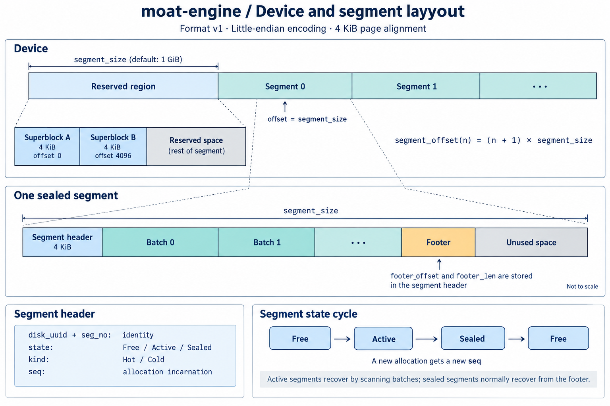
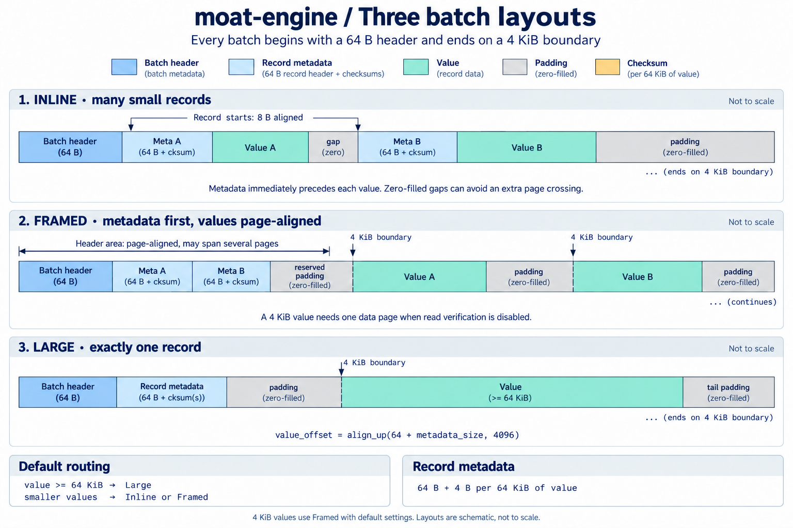
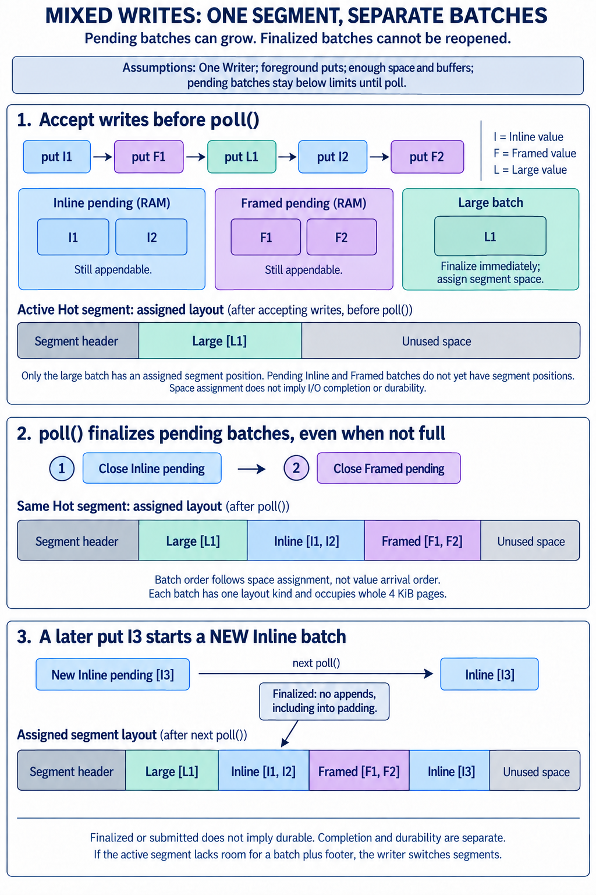
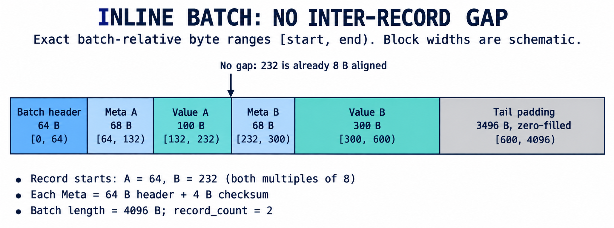
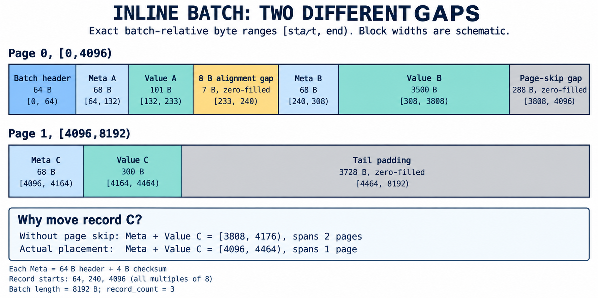
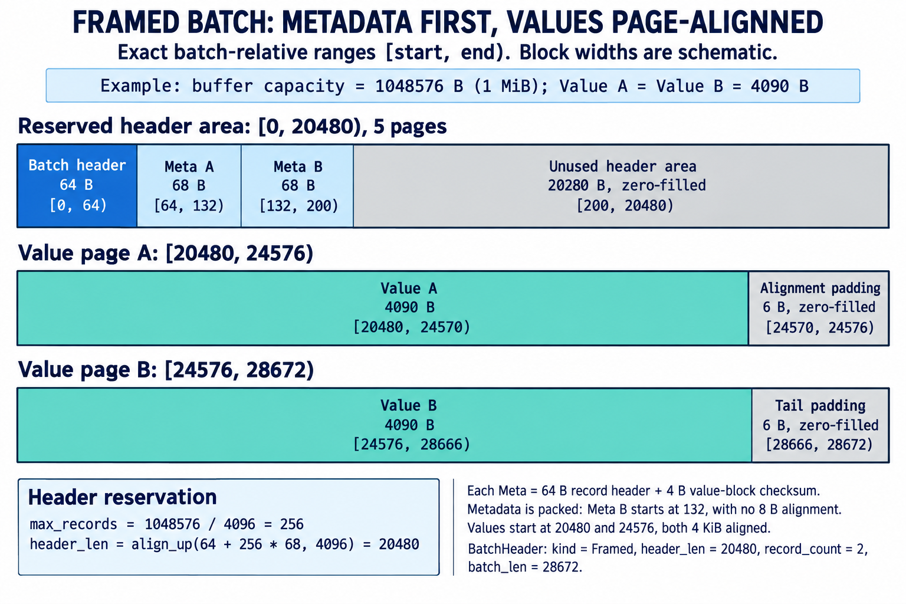
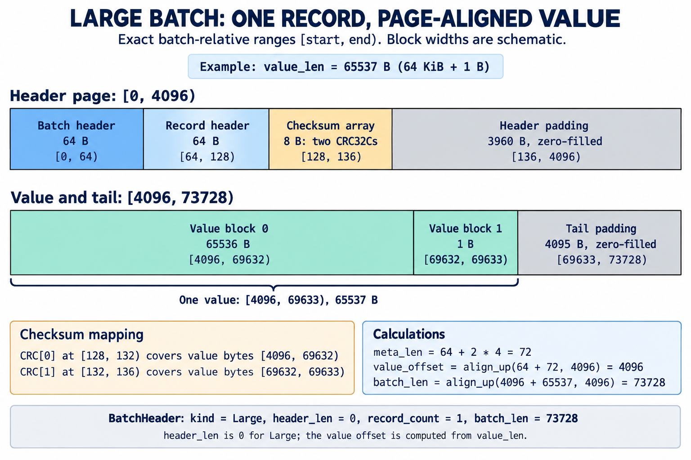

# Engine layout diagrams

These diagrams illustrate the current moat-engine layout for code review. Labels are in English; sizes are schematic. AI-generated and reviewed against the implementation. The [prompt set](PROMPTS.md) includes the batch diagram correction.

The separate [unified Frame proposal](../../design/engine-frame-layout.md)
includes a [detailed proposed layout](unified-frame-layout.png) and its
[generation prompt](unified-frame-layout-prompt.md). That image describes a
candidate format, not the current implementation shown below.

## Device and segment



The first segment-sized region is reserved. A sealed segment's footer follows its batches, before unused space.

## Batch layouts



The 64 KiB routing threshold shown is the default. Record metadata contains a 64 B header plus one 4 B checksum per started 64 KiB of value; an empty value has no block checksums.

## Mixed writes and batch lifetime



Foreground Inline, Framed, and Large batches share the active Hot segment when space permits. Reclaim uses a separate Cold segment. Segment selection does not partition batches by layout kind.

Inline and Framed each have a separate pending batch per Hot/Cold kind. A pending batch can accept more records of its layout kind while they fit. It has no segment position until successfully finalized. Large writes each form a single-record batch and assign segment space without waiting for pending small batches to close.

For the illustrated sequence, all calls succeed, pending batches fit below their limits, there is no intervening poll, and the active segment has sufficient room:

```text
put I1 -> put F1 -> put L1 -> put I2 -> put F2
Before poll: Large [L1] has segment space; [I1, I2] and [F1, F2] remain pending.
After poll:  Large [L1] | Inline [I1, I2] | Framed [F1, F2]
put I3, then poll:
             Large [L1] | Inline [I1, I2] | Framed [F1, F2] | Inline [I3]
```

`poll()` attempts to close all nonempty pending batches, including partially filled ones. The current close loop visits Inline before Framed within each Hot/Cold kind. Placement failures leave the affected batch pending for retry. Other closing triggers include a record not fitting, reaching the batch limit, `flush()`, and `seal()`.

Once finalized, a batch's length and segment position are fixed, even if it is still queued for I/O. Later writes cannot append into its padding or unused framed header area. They start a new pending batch. Finalization does not seal the whole segment; more batches may follow. If a batch plus the reserved footer no longer fits, the writer switches segments.

These strips show assigned space, not I/O completion or durability. The illustrated physical batch order need not match value admission order.

Implementation: [Writer construction, polling, and batch placement](../../../core/moat-engine/src/writer.rs), [pending batch packing](../../../core/moat-engine/src/writer/batch.rs), and [flush, seal, and segment selection](../../../core/moat-engine/src/writer/sealing.rs). [Generation and correction prompts](MIXED-WRITES-PROMPTS.md).

## Exact inline examples

These examples supersede the numeric inline illustration from the initial generated draft. All ranges are batch-relative and half-open: `[start, end)`. Block widths are schematic. Each example record has a 64 B header and one 4 B value-block checksum.



For values of 100 B and 300 B, record B starts at byte 232 immediately after value A. No inter-record gap is required. The batch ends at byte 4096.



For values of 101 B, 3500 B, and 300 B:

| Region | Byte range | Length |
| --- | --- | --- |
| Batch header | `[0, 64)` | 64 B |
| Meta A | `[64, 132)` | 68 B |
| Value A | `[132, 233)` | 101 B |
| Alignment gap | `[233, 240)` | 7 B |
| Meta B | `[240, 308)` | 68 B |
| Value B | `[308, 3808)` | 3500 B |
| Page-skip gap | `[3808, 4096)` | 288 B |
| Meta C | `[4096, 4164)` | 68 B |
| Value C | `[4164, 4464)` | 300 B |
| Tail padding | `[4464, 8192)` | 3728 B |

Without the page skip, record C would occupy `[3808, 4176)` and span two pages. Moving it to `[4096, 4464)` reduces its extent to one page. All gaps and tail padding are zero-filled.

The writer first aligns the next record start to 8 B, then moves it to a page boundary only if this reduces the number of pages spanned by metadata plus value. The scanner skips ordinary alignment arithmetically and recognizes a page-skip gap by four zero bytes at the candidate record start.

Implementation references: [`Pending::next_position`, `append`, and `finish`](../../../core/moat-engine/src/writer/batch.rs), [`parse_batch`](../../../core/moat-engine/src/scan.rs), and [layout constants and metadata sizing](../../../core/moat-engine/src/layout.rs). The exact generation inputs are in [INLINE-PROMPTS.md](INLINE-PROMPTS.md).

## Exact framed example



This example assumes an actual staging buffer capacity of 1 MiB and two 4090 B values. Both values select Framed under the default 64 KiB pack threshold: each value alone needs one page, while its 68 B metadata plus value needs two.

The reserved header area depends on buffer capacity, not the current record count:

```text
max_records = 1048576 / 4096 = 256
header_len = align_up(64 + 256 * 68, 4096) = 20480
```

| Region | Batch-relative byte range | Length |
| --- | --- | --- |
| Batch header | `[0, 64)` | 64 B |
| Meta A | `[64, 132)` | 68 B |
| Meta B | `[132, 200)` | 68 B |
| Unused header area | `[200, 20480)` | 20280 B |
| Value A | `[20480, 24570)` | 4090 B |
| Alignment padding | `[24570, 24576)` | 6 B |
| Value B | `[24576, 28666)` | 4090 B |
| Tail padding | `[28666, 28672)` | 6 B |

Metadata is packed consecutively; Meta B starts at 132 without 8 B alignment. Each value starts on a 4 KiB boundary. The unused header area and both padding regions are zero-filled. The batch header stores `kind = Framed`, `header_len = 20480`, `record_count = 2`, and `batch_len = 28672`. Only the finished batch length is written, not the full buffer capacity.

The scanner starts its metadata cursor at 64 and value cursor at `header_len`. After each record, it advances the metadata cursor by the metadata length and rounds the value end up to the next page.

## Exact large example



This example holds one 65537 B value, which selects Large under the default 64 KiB pack threshold. The value needs two CRC32Cs: one for its first 65536 B and one for its final byte. Both checksums reside in record metadata.

```text
meta_len = 64 + 2 * 4 = 72
value_offset = align_up(64 + 72, 4096) = 4096
batch_len = align_up(4096 + 65537, 4096) = 73728
```

| Region | Batch-relative byte range | Length |
| --- | --- | --- |
| Batch header | `[0, 64)` | 64 B |
| Record header | `[64, 128)` | 64 B |
| CRC[0] | `[128, 132)` | 4 B |
| CRC[1] | `[132, 136)` | 4 B |
| Header padding | `[136, 4096)` | 3960 B |
| Value block 0 | `[4096, 69632)` | 65536 B |
| Value block 1 | `[69632, 69633)` | 1 B |
| Tail padding | `[69633, 73728)` | 4095 B |

CRC[0] covers `[4096, 69632)`; CRC[1] covers `[69632, 69633)`. Those are batch-relative ranges. The blocks form one contiguous value with no embedded checksum bytes. Both padding regions are zero-filled.

The batch header stores `kind = Large`, `header_len = 0`, `record_count = 1`, and `batch_len = 73728`. The scanner computes the value offset from the value length; it does not use `header_len` for Large. A one-page header region is specific to this example: the general calculation rounds the batch header plus variable-length record metadata up to a page boundary.

### Implementation references

- [Framed reservation, placement, and finalization](../../../core/moat-engine/src/writer/batch.rs): `Pending::attach`, `append`, and `finish`.
- [Routing and large writes](../../../core/moat-engine/src/writer.rs): `put`, `reserve_small`, and `write_large`.
- [Metadata sizing and layout calculations](../../../core/moat-engine/src/layout.rs): `record_meta_len`, `prefer_framed`, `large_value_offset`, and `large_batch_len`.
- [Batch parsing](../../../core/moat-engine/src/scan.rs): `parse_batch`.
- [Checksum block sizing](../../../core/moat-common/src/checksum.rs): `CHECKSUM_BLOCK_SIZE` and `block_count`.
- [Exact image generation prompts](FRAMED-LARGE-PROMPTS.md).

## Checksums and range reads


The range-read example places a request within one page of the third value checksum block. With verification enabled, the current reader includes metadata and the touched checksum block in one contiguous I/O extent, including intervening bytes.
