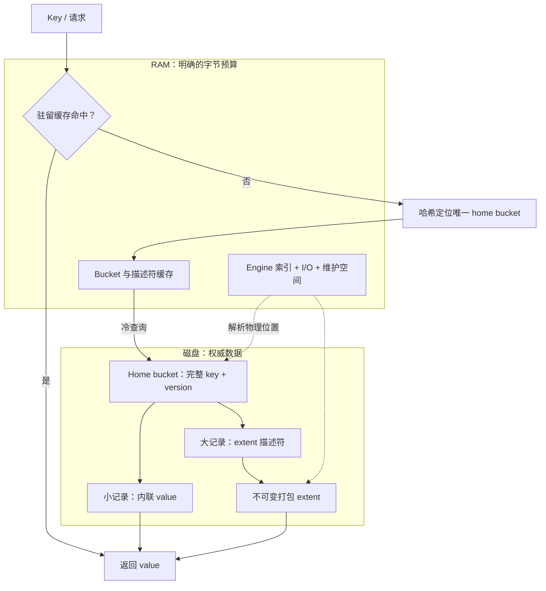
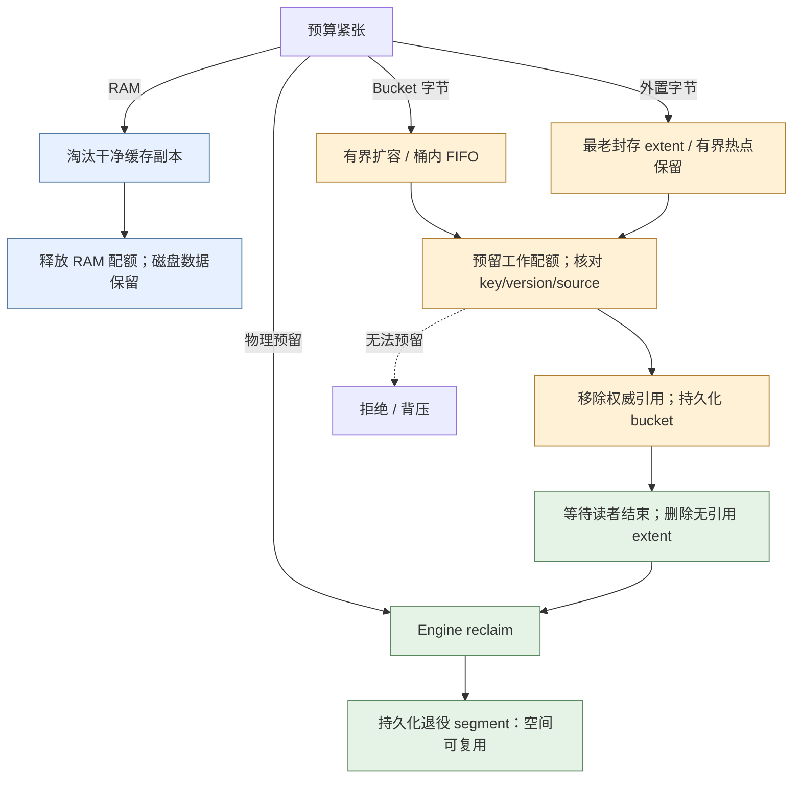
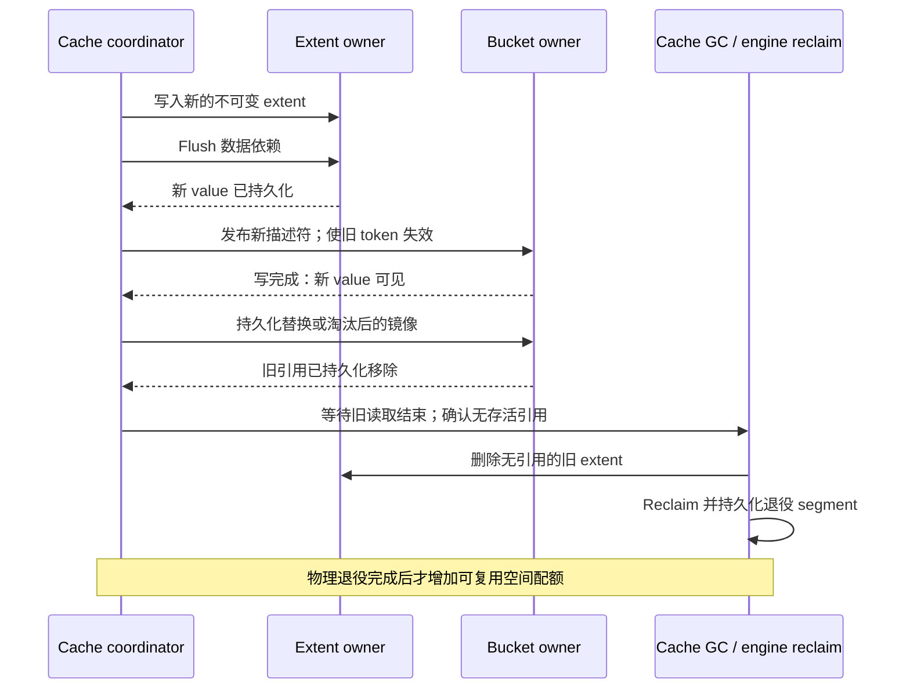
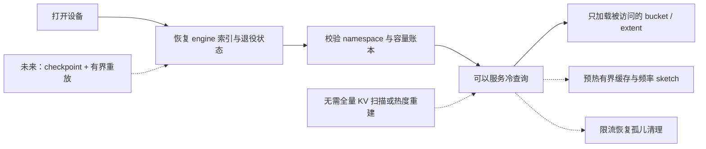

# 大容量磁盘下的缓存内存与恢复设计

[English](cache-bounded-memory.md) | 简体中文

状态：设计提案，2026-10-08。本文不代表已实现的行为或已测得的性能。
本文基于本次设计评审时尚未发布的 packed-cache 和通用 segment reclaim 原型。
下文提及的当前 catalog、回收行为和 API 清单指这些原型，并非已经合入 `main`
的功能。本次仅包含文档的变更不包含这些原型。此前 9 月 20 日的 packed-cache
压测早于本提案，不能用于验证本方案。

## 看图导读

可以先看四张图：[数据放置](#设计决策与范围)、[淘汰决策](#淘汰与准入策略)、
[安全发布与退役](#修改可见性与崩溃顺序)、[恢复过程](#恢复与可服务状态)。
首版建议用桶内 FIFO 和按年龄选择外置 extent 作为基线；固定内存的频率准入与
有复制上限的热点保留，作为后续对照实验。

## 设计决策与范围

为每个 key 确定唯一的归属桶（home bucket），以它作为权威目录。
小记录内联存储，大记录放入不可变 extent，其描述符保存在同一个 home bucket 中。
RAM 只缓存预算允许的部分 bucket 内容和热点描述符。记录大小发生变化时，
更新同一个权威目录，无需维护常驻的逐 key 路由表。

这会替换必须常驻内存的逐 KV catalog，但不会自动消除 Chunk Engine 的逐 chunk
索引。交付分为两个阶段：

1. 基于现有 chunk 操作实现并测试 bucket；只接纳完整 engine 索引能够放入内存预算的磁盘数据规模。
2. 如果目标数据规模超出预算，则增加通用的紧凑索引或分页索引，以及 checkpoint/replay 支持。
   仅修改 cache 层，无法同时承诺任意磁盘容量、较小的固定内存，以及每次缓存未命中后只需一次物理读取。

Cache 负责按大小放置、准入和逻辑淘汰；engine 负责物理寻址、崩溃恢复与 segment
复用。缓存策略不下沉到 engine。驻留内存缓存仍采用独立预算。

图 1：内联记录冷命中读取 bucket，外置记录冷命中还需读取 extent。
缓存的 bucket 或有效描述符可以跳过相应的目录读取；物理校验和 engine 索引
未命中可能增加 I/O。

## 目标与明确的取舍

- 配置进程级内存预算范围，包含恢复和维护期间的峰值。
- 开始服务前无需重建全部 KV 的位置。
- 解析物理索引后，内联命中读取一次 bucket；外置记录的冷命中允许先读 bucket，再读 value。
- 保留完整 key 比较、写完成后可读，以及显式 flush 的持久化语义，不为提速而隐式弱化这些约定。
- 持续覆盖和删除时，元数据与磁盘历史记录的规模保持有界。

RAM 缓存命中无需访问磁盘。物理请求次数还取决于 engine 校验方式、对齐、队列拆分，
以及物理索引是否驻留内存。一次 Cache get 或 Store get 不等于一次设备 I/O。

Bucket 内部淘汰将替代精确的全盘逐 KV FIFO/SIEVE。这会改变偏斜负载下的命中行为，
必须作为明确的缓存策略和格式选择，不承诺与当前缓存具有相同命中率。

## 为什么仅做 packing 不够

当前 catalog 同时保留 `slots: Map<Slot>` 和 `chunks: Map<Pack>`，其中每个 pack
还保留 entry 目录。Engine 独立保留 chunk 位置、key 遍历条目、物理副本计数和
segment 统计。Packing 减少了 engine 记录数，但 cache 元数据仍与逻辑 KV 数量成正比。
当前的目录字节预算不是 RSS 上限。

对本方案定义：

- `Nb`：已分配的 home bucket 数量，包含保留的空 bucket。
- `Ne`：已建立索引的外置 extent 数量，包含尚未回收的 extent。
- `Nt`：已建立索引的 tombstone 和控制记录数量。
- `I`：实测的每个已索引 ID 对应的 engine 有效内存开销，包含配置装载率下的表容量和遍历元数据。
- `H`：为驻留数据、bucket 缓存、描述符缓存、I/O pool、在途操作、锁、恢复与维护临时空间预留的固定内存。

一阶近似为 `M = H + I * (Nb + Ne + Nt) + segment_metadata`。
分配器余量、扩容峰值和碎片需要额外预留空间。`I` 必须实测，不能只用
`size_of(Location)` 代替。

若内联数据字节数为 `Ds`，bucket 大小为 `B`，有效装载率为 `u`，则 bucket 数量
约为 `Ds / (u * B)`。这是乐观估计：仅含目录的记录、负载偏斜、头部和碎片都会
降低有效装载率。以 `I = 128 B`、`u = 0.75`、100 TiB 内联数据为例：

| Bucket 大小 | 仅 engine 索引的近似内存 |
|---|---:|
| 4 KiB | 4.17 TiB |
| 16 KiB | 1.04 TiB |
| 64 KiB | 266.7 GiB |
| 256 KiB | 66.7 GiB |

这些是算术估算，不是 engine 的实测成本。若该索引只有 32 GiB 内存预算，16 KiB
bucket 约能覆盖 3 TiB 内联数据；64 KiB bucket 约能覆盖 12 TiB。这里尚未扣除
其他索引条目和预留余量。

外置数据的增长关系不同。若 extent 为 4 MiB，有效装载率为 80%，且 `I` 仍取上述
假设值，则 100 TiB 数据约需要 4 GiB extent 索引内存，此外还要加上 home bucket
目录和其他预算。只有记录头与目录也能放入配置的 chunk 上限时，4 MiB 目标才合法。

举例来说，若所有 value 都外置，平均 value 为 16 KiB，目录记录为 96 B（包含
key 和 properties），则 100 TiB 数据约包含 67.1 亿条 entry 和 600 GiB 逻辑目录。
按 75% bucket 装载率、16 KiB bucket 及上述 `I` 计算，目录对应的 engine 索引还需
6.25 GiB。Bucket 与 extent 的索引合计约 10.25 GiB，尚未计入预留空间和 `H`。
更长的 key、更小的 value 或更低的 packing 装载率都会显著改变结果。

精确的冷查询总要从某处获得物理地址。把映射放在 RAM 中会占用内存；分页会增加
I/O；采用确定性物理槽位则需要不同的存储分配和恢复设计。更大的 bucket 通过增加
读取字节、更新字节以及共享同一 bucket 的 key 范围来减小映射规模。

## 持久化路由与 bucket 布局

持久化 namespace manifest，记录格式版本、哈希种子、bucket 数量、设备拓扑、
允许的 bucket 大小、各项限制和 ID 分配 epoch。计算
`bucket_number = H(namespace, full_key) mod bucket_count`，通过域隔离的 namespace
和 bucket 编号生成稳定的 ChunkId。不存在的 chunk 表示尚未写入的空 bucket。
被显式清空的 bucket 写成合法的空 bucket 镜像，不在每轮更新和删除中反复删除 chunk。

固定的 bucket 编号不依赖 value 大小。首版在一个 namespace generation 内固定
bucket 数量和磁盘拓扑；修改任意一项都需要显式重建，在线 rehash 暂缓实现。
Bucket 沿用现有 Store 放置规则。Extent 可能位于另一块磁盘，持久化屏障和容量
核算必须覆盖两侧 owner，不能假设不同 ID 经哈希后会落到同一块盘。

Bucket 镜像包含 namespace/格式标识、bucket 编号、镜像修订号、长度、checksum
和变长记录目录。每条记录保存完整 key、逻辑版本、properties，以及以下之一：

- 内联 value；
- 外置描述符：extent ID、offset、length，以及预期的记录标识。

返回 value 前检查完整标识、长度和 checksum。外置记录也保存 key 和逻辑版本。
Fingerprint 匹配只用于加速查找，不能证明 key 相等。根据 bucket 几何限制明确
key 和 properties 的长度上限；若一条记录即使不内联 value，其目录也放不下，
则拒绝该 entry。迁移时不能隐式缩小当前支持的限制。

## 无需逐 key 路由表的尺寸自适应

实验从 4、16、64 KiB 三档 bucket allocation class 开始。每个 bucket 仍是一个
chunk，当前长度来自 engine 索引。所有档位都支持变长记录；这些档位决定 bucket
的分配大小，不是对每个 entry 补齐后的固定槽位。稳定的 bucket ID 让扩容和缩容
都可以通过普通的整 chunk 替换实现。

初始内联阈值设为编码后记录大小 1 KiB，并在 256 B 到 4 KiB 间扫描参数。
这些是实验起点，不是已确定的生产默认值。所有阈值都计入 key、properties 和头部。

插入时根据编码大小和当前策略选择内联或外置。只有先取得磁盘与写入内存配额，
才能扩大 bucket；否则按准入策略进行桶内淘汰或拒绝写入。不能把记录放进无界的
溢出 bucket 链。通过有界维护缩小稀疏 bucket，并使用滞回机制避免反复升降档。

将外置记录打包成 1–4 MiB 的不可变 extent，受 engine 几何限制约束。如果测量
显示按大小或观察到的更新频率分流能减少回收复制量，可以设置少量独立写入流。
全局限制活跃 builder 数量，不为每个 bucket 或每种可能的尺寸分配一个完整 builder。

低频运行的控制器可以根据读取字节、写入字节、命中率、bucket 装载率、淘汰率和
队列延迟，调整内联阈值、各 allocation class 的配额及合并等待时间。
变化优先应用于新写入；旧记录继续从原 home bucket 正常读取，只通过有界工作迁移。
Allocation class 变化不改变哈希函数或 bucket 数量。

增大 bucket 的字节数不会减少索引条目数。如果限制来自 engine 索引预算，就必须
停止分配新 bucket ID 或拒绝容量配置；放置策略控制器无法消除这一限制。

## 淘汰与准入策略

### 区分要释放的资源

| 压力来源 | 选择单位与首版策略 | 实际释放的资源 |
|---|---|---|
| 驻留 value 内存 | 现有配置的驻留策略，按字节计权 | 驻留资格；外部仍持有的版本继续计费 |
| Bucket/描述符内存 | 有界缓存上的按字节计权 SIEVE | 干净的缓存副本；磁盘内容保留 |
| Bucket 镜像空间 | 桶内最早的逻辑插入或覆盖，即 FIFO | 下一版镜像中的内联或描述符字节 |
| 外置数据分配预算 | 受压写入流中最老的已封存 extent | 先解除引用，再经安全回收释放 extent 存储 |
| Engine 物理预留 | 按无效字节比例进行通用 reclaim | 持久化退役后可复用的物理 segment |

脏 bucket 镜像属于计入预算的写入流水线，不属于干净的元数据缓存。Pin 可能阻止
立即释放 RAM，此时准入施加背压，不超出预算。淘汰元数据缓存会使描述符 token
失效，但不会删除磁盘记录。磁盘淘汰只移除磁盘驻留资格，仍有效的内存 value 可以
依独立策略保留。显式 invalidate 则通过现有逻辑 key 协调同时移除两层数据。

图 2：这是不同资源压力的处理方式，并非每次写入都会执行所有分支。释放描述符
字节不等于释放 extent 字节，删除 chunk 也不等于得到可复用 segment。如果候选
RAM 全被 pin，内存分支同样施加背压。替换 bucket 仍需消耗追加空间。
Reclaim 无法取得进展时同样施加背压，箭头不代表一定能获得空间。蓝色表示释放
RAM，黄色表示改变逻辑驻留，绿色表示退役物理存储。

### 桶内替换与准入

用桶内 FIFO 作为参考策略。插入顺序保存在 bucket 镜像中；逻辑覆盖排到队尾，
搬迁则保留原有年龄。不能仅为维护最近访问顺序，就在命中时重写 bucket。
插入前，根据候选记录所需的完整 bucket 编码字节计算整个 victim 集合，计入
key、properties、描述符开销和可能的尺寸档位变化。替换外置描述符在桶内只释放
目录字节。

发布任何淘汰前，先取得所有目标写入、屏障和维护所需的配额。如果候选记录最终
无法写入，不能先淘汰无关记录，再发现物理空间仍不够。应在逻辑修改前拒绝请求，
保留该 key 之前已提交的版本。现有 insert 约定不能静默变成“返回成功但没有写入”。
未来若增加 best-effort fill API，需要独立、明确的未准入结果。

第二组可选实验是 TinyLFU 风格的频率准入：少量固定分片共享定长、会衰减的 sketch。
其计数器、锁和重置工作全部计入 `H`。所有访问路径都应参与采样，包括内存命中
和 miss，避免信号只反映磁盘未命中。Sketch 冲突或历史信息被淘汰只影响策略质量，
不能影响 key 身份、版本检查或权威的不存在判断。重启时清空历史，在有界预热期
使用 FIFO，不为恢复热度而阻塞启动。

先比较候选记录的估计频率与整个 FIFO victim 集合的频率总和，设置可配置的优势
门槛。这个目标偏向对象命中率，不宣称能优化字节命中率。字节命中或回源成本目标
应单独实验，并同时报告两类命中率，防止大对象仅凭体积大就占优。覆盖不能绕过
容量核算，也不能保留旧磁盘值却声称新值已成功存入。Victim 在 bucket 串行化保护
下重新核对。

不能把 sketch 辅助的 FIFO 称为精确 SIEVE 或 LRU。为全体 entry 保存精确 recency
或 visited bit，要么重新引入随 KV 数量增长的 RAM，要么引入命中时的磁盘写入。
有界元数据缓存可以使用 SIEVE；完整磁盘数据集使用持久化 FIFO 顺序及可选的近似热度。

### 外置容量与热点保留

仅靠桶内 FIFO 无法约束外置数据字节：一个 1 MiB value 可能只在 bucket 中占用
很小的描述符。按盘、按少量写入流核算已分配 extent 字节，包含死记录和孤儿数据。
维护持久化的 extent 分配账本和有界游标，不建立全体 KV 的淘汰链表。容量账本的
checkpoint 必须支持有界重放，不能为恢复精确逻辑存活字节数而在启动前扫描所有 KV。
核算尚未校验时，保守地不发放不确定配额。物理 segment 预留是独立的硬准入条件。

基线策略在受压写入流中按分配顺序遍历已封存 extent。每条记录都要与其 home
bucket 核对，仅有条件地淘汰匹配 version/source 的记录。仍有待发布描述符的
extent 即使已经封存，也不能参与回收，直到相关引用已持久化或被放弃；封存本身
不代表具备回收资格。不能因为旧副本位于选中的 extent，就淘汰并发覆盖后的新值。
这一 cache 策略可以主动淘汰存活记录；
engine reclaim 本身仍保留所有被引用的 chunk。

可选优化是在退役 extent 前复制热点存活记录。每轮限制复制字节和工作量，预留
目标配额，并限制连续保留轮数。若整个 victim 都很热，必须选择另一个有界候选、
执行策略允许的淘汰，或施加背压，不能无限复制。搬迁保留逻辑插入年龄，避免反复
复制让记录永久“年轻”。访问热度与物理分配顺序是不同信号。

只设置少量共享的内联/外置或尺寸写入流，提供最低空间保障和可借用空闲分配配额
的软上限。根据对象/字节命中率、淘汰年龄、各尺寸 miss、复制成本和设备写入预算，
缓慢调整份额。调整配额不会立即释放字节：捐出方只有完成安全回收后才真正缩小。
Bucket 数量和哈希路由保持不变。偏斜 bucket 不能无限消耗全局空间，也不能随意
淘汰其他 bucket 中的 key；即使别的 bucket 有空位，它也可能拒绝准入。应单独测量
这种桶关联度限制导致的容量和命中损失。

若启用磁盘优先级，应在记录中持久化 priority，并设置有上限的保护份额。
High priority 是偏好，不是无限 pin；不能从驻留 handle 推导出磁盘永久固定。
现有 pin 延后的是旧字节的释放，而不是逻辑淘汰决策。首版策略命名必须区分桶内
FIFO 与现有全盘 SIEVE，不能把同一个 enum 值静默映射成不同的淘汰约定。

### 淘汰正确性与评估

淘汰复用普通修改的 key/version/source 核对、驻留版本 generation 屏障和描述符
失效机制。先提交 bucket 中的引用删除，再删除被引用的 extent。重启后不能从
孤儿数据复活已淘汰 entry。可以丢失频率与 recency 提示，不能丢失权威的删除顺序。
用户通知在锁外执行；计数器和未来 callback 应区分 RAM 淘汰、磁盘淘汰、准入拒绝
与显式 invalidate。

在相同 RAM 和写入预算下比较纯 FIFO、FIFO 加频率准入，以及有界热点保留。
覆盖扫描、Zipf 偏斜、阶段变化、同桶冲突、大小对象竞争、反复覆盖、被 pin 的
读取、全热点 extent，以及逻辑淘汰与物理复用之间的崩溃。报告 victim 字节与真正
新增可复用字节、对象/字节命中率、各尺寸淘汰年龄、拒绝写入数、GC 复制字节、
p99/p99.9 和恢复预热期的命中损失，不能只根据吞吐量选择策略。

## 读取路径与有界热点状态

| 状态 | 数据路径读取，不计 engine 映射未命中和队列拆分 |
|---|---|
| 驻留 value 命中 | 0 次 |
| Bucket 已缓存，记录内联 | 0 次 |
| Bucket 未缓存，记录内联 | 读取 1 次 bucket |
| 有效的热点外置描述符 | 读取 1 次 extent 范围 |
| 外置记录和目录均未缓存 | 读取 1 次 bucket，再读取 1 次 extent 范围 |
| 未知 key，且无可信的不存在摘要 | 读取 1 次 bucket |

Bucket 缓存和描述符缓存分别设置预算。描述符仅在其关联的 bucket 一致性 token
有效期间可用。每次 bucket 修改都必须在发布新镜像前使旧 token 失效或替换它；
丢弃 token 会使其关联的全部缓存描述符失效。Engine compaction 保持 extent ID
不变；cache 层的搬迁则显式更新描述符。

读取必须在持有 bucket 准入锁期间，且源 extent 的删除尚不能被接纳时，登记有界的
外置 extent 引用。并发逻辑更新可以与已接纳的读取重叠，但更新完成后接纳的新读取
不能再使用旧描述符。读取 pin 和返回的 buffer 都计入预算，在 pin 耗尽内存前拒绝
准入或施加背压。

不强制在 RAM 中维护覆盖所有 key 的 Bloom filter。每个 key 即使只用 10 bit，
100 亿个 key 也约需 11.6 GiB。可选的不存在摘要必须有明确预算。重启后，摘要在
与当前精确的 bucket 镜像完成校验前处于 UNKNOWN 状态；UNKNOWN 必须继续查找，
旧 filter 绝不能把新 key 判为不存在。可选摘要丢失或损坏不代表应用数据不存在。

首版应使用 engine 原生校验读取。后续若增加 direct-read 模式，需要 bucket/record
envelope 的独立校验，以及明确的损坏模型。即使 bucket 为 4 KiB，若 engine 将其
value 放在未对齐的 offset，它也可能跨越两个物理页。应测量实际读取范围，不能
假定只读一个对齐页，也不能仅为了满足 I/O 次数目标就关闭完整性校验。

## 修改、可见性与崩溃顺序

使用固定数量分片的 coordinator，按 bucket 串行化读改写操作。同一 bucket 中
不同 key 的操作不能相互覆盖更新。全局限制排队任务数和字节数。在有界等待时间内
合并已接纳到同一 bucket 的兼容修改；对数十亿 bucket 的均匀随机写入，合并机会很少。

内联更新或删除需要替换一个 bucket 镜像。Engine 按版本顺序确定有效镜像。
已持久化删除表现为最新完整镜像中不存在该记录，整个 bucket 为空时亦然。
不能通过重放任意旧 bucket payload 重建 KV 状态。

外置插入或替换采用引用发布协议：

1. 分配永不复用的 extent 标识，并写入完整 extent。
2. 在涉及的每块 extent 磁盘上成功完成持久化屏障，确保数据持久化。
3. 在 bucket 串行化保护下，发布包含新描述符的镜像。
4. Bucket 写完成后返回可见性完成通知。后续显式 Cache flush 持久化这些 bucket 镜像，之后才报告持久化完成。

图 3：图中展示外置记录替换。单纯淘汰跳过新 extent 的创建，但仍需持久化删除
和等待旧读取结束。后台清理可以提供 bucket 屏障，不必依赖调用者 flush。
纯 compaction 必须复制所有仍被引用的存活记录；策略驱动的淘汰则可以先主动移除
选中的记录。

可以把多个 extent 的第 2 步合批，以摊薄同步成本。但即使调用者没有请求 flush，
发布引用前也必须存在真实的持久化屏障。崩溃后可能恢复出尚未 flush 的 bucket
镜像，它不能指向从未持久化的 extent。仅有写完成通知不足以满足这一要求。

内联转外置或外置转内联都修改同一条 bucket 记录，不存在两套按尺寸划分、彼此
竞争的 key 目录。只有替换或删除该引用的 bucket 镜像持久化后，才能回收旧外置
数据；删除操作无需同步回收这些字节。

使用 ID 序列范围前先持久化预留，崩溃后放弃未使用的 ID。ID 包含 namespace epoch
和类型标记，绝不复用孤儿数据的标识。逻辑记录版本也从具备相同崩溃安全性的单调
序列中分配；搬迁保留版本，新的逻辑修改分配新版本。Manifest 更新协议需要带
checksum 的 generation，并遵循先写副本、再发布根的顺序。已提交的根若格式损坏，
应报告错误，不能视作允许重新格式化。

## 不依赖完整逐 KV 内存目录的回收

保留有界的逐 extent 摘要，或者通过固定容量缓存对它们分页。摘要用于选择候选，
不能作为 extent 已无活跃引用的权威证据。扫描一个候选的磁盘记录目录，按 home
bucket 分组，并在对应 coordinator 保护下与当前 bucket 记录比较。所有工作在
临时空间预算内流式执行，不能把全部存活描述符聚集到 RAM 中。

将存活记录复制到新 extent 并持久化，随后仅在 key、version 和 source 仍匹配时
有条件地发布新描述符。持久化全部被修改的 bucket，等待旧 extent 的读取者结束，
之后才能删除源 extent。Extent 封存后，前台写入不能再为旧 extent 创建新引用；
这条不变量保证已经完成的逐记录检查仍有意义。Cache 搬迁和前台修改共用同一套
串行化与 pin 协议。

在发布前崩溃会留下孤儿目标数据；部分发布后崩溃则可能同时保留两个 extent，
由 bucket 决定哪条记录是当前版本。不能自动把孤儿记录重新加入目录。
可续跑的后台扫描将 extent 记录与对应 home bucket 比较，回收无引用记录。
维护日志可以加速扫描，但不能成为发现泄漏数据的唯一途径。为孤儿空间设置预算，
清理跟不上时停止接纳写入。

Cache 层回收和通用 engine reclaim 是两个独立的写放大来源，必须分别测量。
Engine 必须有保证可用的搬迁预留空间，cache 维护也必须有预留输出空间和内存。
前台准入应在消耗任意一类预留之前停止。一次无进展的回收应返回资源压力，不能
无限循环，也不能删除仍被引用的存活 extent。

## 恢复与可服务状态

恢复成本分为两层，消除 cache 的 KV 扫描只能解决第二层：

图 4：Engine 恢复仍在启动关键路径上。读取开始服务时，未经验证的容量配额仍可
使写入保持背压。Checkpoint 路径是计划中的 engine 改造，不是当前原型已有的能力。

1. **Engine 恢复：**当前代码遍历物理槽位，恢复已封存 segment 的 footer 元数据，
   并扫描活跃或 footer 不可用的 allocation。在服务数据前重建物理 chunk 索引
   和副本计数。反复覆盖 bucket 可能在尚未退役的 segment 中留下大量历史记录。
2. **Cache 恢复：**engine 就绪后读取 namespace manifest，校验拓扑、格式和预算，
   随后按需加载 bucket 来服务查询。无需强制枚举或读取每个 bucket、extent 或逻辑 key 的 payload。

当前 `Store::new` 会物化完整的存活 chunk 清单，并依次启动、等待各 owner。
需要增加无需 inventory 的打开路径、有界的流式 inventory 接口，以及并发度受限的
多盘打开。Engine 已有分批 visitor，可用于支持 adapter。一次有界的 inventory
步骤执行期间，应防止 GC 使 cursor 失效，或者能够安全地重新开始。

分别报告首盘可用、全部磁盘就绪、冷启动服务以及命中率预热的时间。不能把一个空的
替代缓存称为恢复完成。权威 bucket 损坏时应返回明确的损坏错误，不能静默当作普通 miss。

为了在大容量下快速恢复，通用 engine checkpoint 最终必须覆盖 chunk 位置与
tombstone、generation 和 LSN watermark、副本计数、segment 存活字节统计，以及
退役与复用状态。只包含位置的 checkpoint 不足以支持安全 reclaim。Checkpoint
之后的变化包括搬迁和退役，不只是前台写入。

只有 checkpoint 数据持久化后，才能发布带 checksum 的 checkpoint 根；在新根
持久化前，保留所需的重放依赖。通过持久化的进度限制约束重放字节数，checkpoint
落后时限制修改速率。校验被引用 segment 的 generation，防止复用与 ABA 错误。
这是独立的 engine 设计前提，不是现有 API 已具备的能力。

全量加载的 checkpoint 仍需读取整个索引并为其分配内存。采用分页索引时，持久化
一个小根及不可变、带 checksum 的目录，重放有界增量，并通过明确的 RAM 预算加载
索引页。冷映射未命中会增加元数据 I/O。后台预热必须共享同一内存预算和 I/O 限流器。

## 内存与容量准入

配置规划器必须覆盖：

| 预算 | 包含内容 |
|---|---|
| Engine | 活跃 ID、tombstone、遍历结构、segment 数组、checkpoint/replay 状态 |
| 驻留数据 | Entry、元数据和外部仍持有的版本 |
| Bucket/描述符缓存 | 分配内存、表容量和一致性 token |
| I/O | 各盘 pool、注册内存、排队写入和仍被持有的读取 buffer |
| 前台暂存 | Extent builder、bucket 镜像、等待者和完成状态 |
| 维护/恢复 | 源与目标 buffer、流式目录和重放 |
| 余量 | 分配器余量、表扩容临时空间和运行时开销 |

首版准入固定已索引 ID 的数量上限，包含 tombstone 和孤儿数据预留。分配前预留
配额，只有 engine 实际忘记该 ID 后才释放。Engine 索引限制必须同步配置；当前
1,048,576 条的默认值不能代替大容量磁盘的容量规划。

使用预定容量的数据结构，或者核算扩容期间旧分配与新分配同时存在的峰值。
所有阶段同时取得操作数和字节数配额。共享已计费 buffer 的引用时不重复计费，
但最后一个持有者释放前不能撤销计费。公开 handle 不能产生无界且未计入预算的分配。
整体 RSS 目标需要实测余量；仅有逻辑字节计数器不构成严格的 RSS 保证。

启动时，根据声明的记录大小和 key 分布输出容量估算，以及最坏情况下的 entry
数量上限，并在运行期间验证。如果所需容量与内存预算无法同时满足，应返回配置
错误或明确提出更低的可用容量，不能静默超用 RAM，也不能暗示仍可用满磁盘。

## 备选方案与建议

| 设计 | 内存 | 冷读取 | 修改与恢复影响 |
|---|---|---|---|
| 当前 packed catalog | 逐 KV 加逐 chunk 开销 | 通常读取一个数据范围 | 已有实现；启动时全量恢复 KV 目录 |
| 现有 engine 上的 home bucket | 逐 bucket/extent 开销，加有界热点状态 | 内联读 bucket；外置先读 bucket 再读 value | Engine 语义变化较小，但映射内存仍限制容量 |
| Home bucket 加分页 engine 映射 | 有界映射缓存，加根和增量 | 可能增加映射页读取 | 需要通用 engine 改造；有界重放可避免启动时加载整个索引 |
| 固定地址的 bucket page arena | 算术寻址，加有界热点状态 | 读取一个 bucket 范围 | 需要独立设计通用页存储、原子替换/WAL 和恢复 |

建议用第二种方案做可测量的原型；容量计算表明现有映射不满足要求时，以第三种
方案为目标。紧凑的稠密 engine 表可以支持中等规模部署，但其内存仍与 bucket
数量成正比。如果索引放不进 RAM，而小对象冷查询又必须只做一次 I/O，则值得考虑
更接近 BigHash 的固定地址页方案。对稳定 ChunkId 调用 `Store::put` 并不等于
固定地址页：它依然使用追加日志和 RAM 中的物理地址映射。

不能仅为缩小索引，就把数百个独立可修改的 bucket 合进一个大 chunk。
当前 engine 不支持范围更新，每次修改都要重写整个 chunk。同样，如果持久化
小增量却没有有界的查询和合并设计，就只是把索引成本换成了读取链和恢复积压。

## 测量与交付门槛

1. 测量 engine 每 ID 的有效内存、扩容峰值、bucket 实际物理读写大小、正常与异常
   关闭后的恢复字节数和重放速率。用实测数据与目标容量、内存约束建立计算器。
2. 基于现有 engine API，实现固定 bucket 数量、静态内联阈值的原型。去掉强制
   KV catalog 和启动 inventory，实现一致性、引用发布屏障、空镜像及有界外置数据回收。
3. 静态设计通过崩溃和持续更新测试后，再增加 bucket 尺寸自适应和少量外置写入流。
   使用相同 RAM、CPU、磁盘和持久化预算，与简单配置比较。
4. 通用索引/checkpoint 改动须先独立评审故障模型，并证明有可测的容量或恢复收益，
   然后重新运行端到端测试。

压测矩阵必须覆盖 100 B 到 4 MiB、真实 key/properties 长度、小对象数量占主导和
大对象字节数占主导的混合负载、均匀/Zipf 访问、冷热阶段切换、持续覆盖与删除、
同 key 的大小变化、不存在 key 的查询、接近满盘，以及回收与前台流量并发。
使用相同 trace/seed，除速度外同时报告对象命中率和字节命中率。

比较当前 packed cache、静态 bucket、自适应 bucket；条件允许时增加固定版本的
CacheLib Navy 基线。明确对齐语义：不能将 CacheLib 缓冲写入的确认等同于 Moat
flush 的持久化完成。原生完整性校验与仅校验 cache envelope 的实验应分别呈现。

累计写入量应足以让可用容量周转多次，并展示活跃字节、历史字节、RAM 和空闲
segment 已稳定。测量每操作物理读取次数、设备读写字节、包含两层回收的写放大、
CPU、RSS、pinned memory、p50/p99/p99.9、积压及预留空间耗尽情况。
两轮短时 fill/read 测试不能证明稳态行为。

恢复场景包括正常 close、进程被杀、每个发布/退役边界的崩溃、可选摘要缺失、
已提交元数据损坏、checkpoint 失败，以及有界的孤儿数据积累。记录首次服务与
完全就绪时间、读取字节、内存峰值和预热期间的前台延迟。验收要求包括旧值不会
复活、被引用的 extent 不会被释放、资源使用有界，以及过载时有明确背压。
性能和恢复 SLO 的具体数值仍需由部署目标给出，不能作为未经测量的承诺。

## 参考资料

- [CacheLib Navy 概览](https://cachelib.org/docs/Cache_Library_Architecture_Guide/navy_overview/)：按大小选择 engine，以及内存取舍。
- [CacheLib 小对象缓存](https://cachelib.org/docs/Cache_Library_Architecture_Guide/small_object_cache/)：确定性 bucket、checksum、FIFO 和可选 filter。
- [CacheLib 大对象缓存](https://cachelib.org/docs/Cache_Library_Architecture_Guide/large_object_cache/)：带索引的追加 region 与持久化。
- [Engine 指南](../../core/moat-engine/README.md)和[驻留缓存所有权](cache-memory.md)：已合并实现的背景；提案与原型扩展已在上文明确说明。
