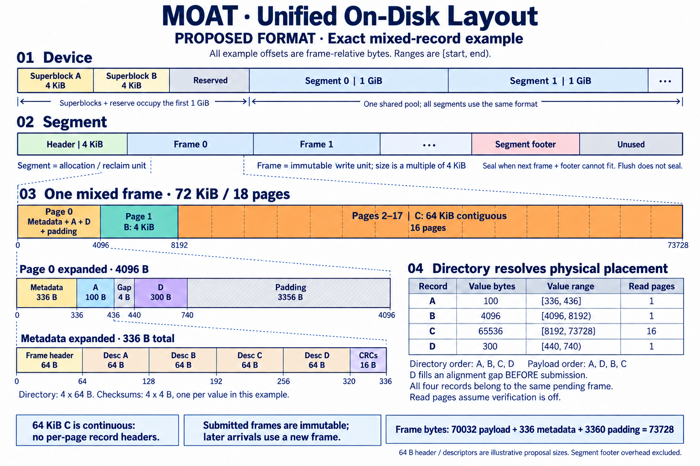

# Unified immutable frames for the chunk engine

The current [segment format](engine-segment-format.md) uses a separate allocation header and a footer trailer at the segment end. All alpha format versions are 1. The architectural discussion below provides the original context.

Status: staged implementation in the independent
[`moat-engine` crate](../../core/moat-engine/README.md). Stage 1 implements
the frame codec, construction, and validation. The existing `moat-engine`
still writes Inline, Framed, and Large batches; its API and format are unchanged.

## Summary

Replace the three persistent batch kinds with one immutable Frame format:

```text
Frame header | Record directory | Checksums | Values + gaps | Tail padding
```

Use an actual-size directory with explicit value offsets. Pack small values,
page-align values when useful, and retain prepared large-value buffers as a
single-record fast path through the same format. Foreground writes and GC
relocations continue to allocate segments from the same per-device free pool.

The main benefits are less metadata reservation under light Framed workloads,
the ability to batch different value sizes together, and fewer format branches
in readers, scanners, and reclaim. The main costs are assembling a variable
directory before payloads and fetching separate metadata for verified reads.
Space calculations below are not throughput or latency measurements.

This proposal supersedes the default direction in the earlier
[open-inline-page proposal](engine-write-layout.md). Frames are submitted once;
their padding is never filled by rewriting submitted pages. The earlier
prototype models a different encoding and does not validate this design.

## Goals and semantic boundaries

- Support values from zero bytes through the configured maximum without an
  upper-layer packing requirement.
- Keep one record representation, independent of performance thresholds.
- Preserve the single-writer, multiple-reader model per device, full-key DRAM
  indexing, LSN ordering, tombstones, and reader pinning.
- Preserve recoverable storage semantics: valid records are retained until
  deleted or overwritten. Space pressure does not authorize eviction.
- Keep ordinary range reads independent of the size of the containing Frame.
- Preserve the prepared-buffer path for large values without a payload copy.
- Keep data self-describing; no separate metadata database or WAL is added.

This is not an index-compression project, an eviction-policy change, a
multi-writer redesign, or a new transport protocol. Size thresholds already
are runtime options in the current engine; this proposal reduces the number
of persistent layouts those options select.

Write completion and power-loss durability remain distinct. A successful PUT
publishes a completed write; guarantees across power loss require the relevant
device contract and persistence barrier. Sealing is not a substitute for that
barrier, and a segment need not be sealed to be recoverable.

## Layout overview



The diagram is schematic; its labeled offsets are exact for the example.
The **segment footer** belongs to the whole segment, not to an individual Frame.
Frames have no footer or mandatory trailer page. The independent codec implements
the 64-byte Frame header and 64-byte descriptors; these sizes remain subject to
review before enabling a new engine writer.
The gap-filling placement shown is optional; sequential placement is the
initial implementation baseline.

The image was generated with AI and reviewed against the geometry below.
Its [generation prompt](../assets/engine-layout/unified-frame-layout-prompt.md)
is included for maintenance.

| Unit | Responsibility | Lifetime |
| --- | --- | --- |
| Device | Format identity, geometry, index, and segment pool | Format to reformat |
| Segment | Allocation, sealing, and reclaim | Allocation incarnation to reuse |
| Frame | Physical write and recovery-validation boundary | Mutable construction, then immutable |
| Record | Key, logical version, and contiguous value or tombstone | Until superseded or deleted |
| Stream | Placement policy for foreground or relocation traffic | Runtime writer state |

## Device and segment layout

### Device geometry

Retain the current default geometry for the first implementation:

- Two 4 KiB superblocks at the start of the device.
- Reserved space through the end of the first segment-sized region.
- Fixed-size segments, initially 1 GiB each.
- A maximum value size of 4 MiB by default.

```text
segment_device_offset = segment_size * (segment_no + 1)
```

The first 1 GiB in the default geometry contains the two superblocks and unused
reserved space; it is not 1 GiB of required metadata. Keeping that reservation
avoids an unrelated geometry change. It is not a requirement of the Frame
format and can be revisited independently.

Superblocks identify the device and format and record the geometry. A/B copies
require checksums, generations, and a defined update protocol; merely having
two copies does not establish crash safety.

The new format also needs a format-wide maximum Frame length. Record-count
and metadata bounds must be validated against encoded geometry before memory
allocation. Recovery bounds must not depend on the runtime batching target
used by the process reopening the device.

### Segment contents and size

```text
Segment header | Frame 0 | Frame 1 | ... | Segment footer | Unused tail
```

The segment header occupies one 4 KiB page. It records device identity,
segment number, allocation incarnation, state, and sealed-footer geometry.
Each Frame follows the previous Frame at a page boundary. A record does not
cross a Frame, and a Frame does not cross a segment.

Keep separate foreground and relocation streams, backed by the same free
segment pool. They share the same persistent format and have no fixed capacity
partition by object size.

The 1 GiB default is a starting point, not a newly measured optimum. Smaller
segments provide finer reclaim selection and smaller individual scan units;
larger segments reduce segment turnover and relative tail waste. Compare
256 MiB and 1 GiB under representative churn before changing the default.
Segment size does not determine the size of each write: Frames can be
submitted long before the segment fills.

### Footer and sealing

The segment footer summarizes records for index reconstruction. Its entries
must locate the Frame and descriptor as needed by the new reader, as well as
preserving keys, LSNs, value locations, lengths, and tombstones. The initial
implementation stores each Frame's original metadata in the footer;
the [segment format document](engine-segment-format.md) specifies its exact
encoding and admission accounting. This preserves checksums and reuses Frame
validation, with a larger footprint than the old 48-byte summary entry.

Before placing a Frame, reserve enough room for both data and the eventual
footer, including records allocated but not yet applied:

```text
allocated_tail + next_frame_bytes
    + footer_bytes(applied_records + unapplied_records + next_records)
    <= segment_size
```

When the next Frame and footer cannot fit, allocate a fresh segment and park
the old one for sealing. The old segment stops accepting Frames, drains its
writes, writes its footer, and then writes the header marking it sealed.
Sealing can progress while the new segment accepts writes. Completion order
and the required persistence order must both be enforced.

Explicit `seal()` also closes active segments, for example before shutdown.
Ordinary `flush()` and a Frame's byte/deadline trigger do not seal a segment.
Sealing a nearly empty segment strands its unused tail until reclaim.

## Candidate Frame encoding

All integers use an explicit little-endian encoding, not Rust struct layout.
Stored value and checksum offsets are Frame-relative. Field offsets in the
tables are relative to the start of the corresponding structure. Reserved bytes
and padding are written as zero; unsupported flags and versions are rejected.
The independent codec uses frame magic `MOATFRM1` and version `1`. The segment
encoding is specified [separately](engine-segment-format.md).
Device encoding remains a later stage; these constants do not define a
complete new device format.

### Frame header

This candidate header is 64 bytes:

| Offset | Bytes | Field | Purpose |
| ---: | ---: | --- | --- |
| 0 | 8 | Magic | Identify the primitive |
| 8 | 4 | Format version | Select the decoder |
| 12 | 4 | Header CRC32C | Validate the header before trusting geometry |
| 16 | 8 | Segment incarnation | Reject content from an earlier allocation |
| 24 | 4 | Frame offset within segment | Bind the header to its physical position |
| 28 | 4 | Frame length | Locate the next Frame |
| 32 | 4 | Record count | Bound the directory |
| 36 | 4 | Directory length | Locate the checksum area |
| 40 | 4 | Checksum area length | Locate the earliest possible payload byte |
| 44 | 4 | Metadata CRC32C | Validate directory and checksum bytes |
| 48 | 16 | Reserved | Future encoding space |

The header CRC covers the header with its own field zeroed, including the
stored metadata CRC. The metadata CRC covers the complete directory and
checksum area. These checksums protect structure, not payload atomicity.
Recovery also verifies every record's payload checksums before accepting the
Frame.

The 32-bit geometry fields require explicit format bounds. In particular,
segment size must be below 2^32 bytes in this candidate encoding; do not accept
larger geometry and truncate offsets. A Frame must be at least one page, have
at least one record, and fit both the format-wide Frame bound and its segment.

### Record directory

Each descriptor replaces the old record header. There is no second copy of
that header immediately before the value. A candidate 64-byte descriptor is:

| Offset | Bytes | Field |
| ---: | ---: | --- |
| 0 | 16 | Full key |
| 16 | 8 | LSN |
| 24 | 4 | Value offset |
| 28 | 4 | Value length |
| 32 | 4 | Checksum offset |
| 36 | 4 | Checksum count |
| 40 | 1 | Record kind: data or tombstone |
| 41 | 1 | Flags |
| 42 | 22 | Reserved |

The directory is exactly `record_count * descriptor_size` bytes. It can be
smaller or larger than a page. Values are contiguous individually, but their
physical order need not match descriptor order. LSNs determine logical version
order, including when multiple operations target the same key.

A tombstone has no payload or payload checksums. A zero-length data record is
still data, not a tombstone. For zero-length values, use zero value/checksum
offsets as sentinels and a zero checksum count; validate those cases separately
from nonempty value ranges.

Only 42 descriptor bytes are assigned in this draft. A 48-byte encoding is a
reasonable later comparison, particularly for tiny values. The current choice
keeps the baseline comparable with existing 64-byte record headers; it is not
a demonstrated optimum.

### Checksum area and payload placement

Retain CRC32C per 64 KiB of each logical value, including its final partial
block. An empty value has no payload checksum. This block size is independent
of physical page boundaries.

```text
checksum_count(value) = ceil(value_length / 65536)
metadata_bytes = 64 + 64 * record_count
                 + 4 * sum(checksum_count(value))
```

Store checksum arrays consecutively in descriptor order and record explicit
offsets for nonempty arrays. A 1 MiB value needs 16 checksums, or 64 bytes.
No checksum bytes are interleaved with payload blocks, preserving continuous
range reads and prepared large buffers. Caller-supplied block checksum APIs
must retain their explicit validation contract.

Placement starts after the actual metadata end. Nonempty value starts have a
fixed 8-byte alignment, enforced by both the builder and decoder without a
configuration switch. Value lengths need not be multiples of eight. The current
`crc-fast` small-value path can process aligned `u64` words without a bytewise
prefix, providing a concrete reason for this baseline. Basic alignment adds
0–7 padding bytes per nonempty value; its benefit depends on value sizes and
the checksum implementation.

A value may move to a page boundary when that reduces its whole-value
read page count; prepared large buffers and large range-readable values use
page alignment. Whole-value page minimization is not necessarily optimal for
every partial-read distribution.

All remaining gaps and tail padding are zero-filled. Round the final Frame
length to 4 KiB; no separate trailer page is required. Metadata and small
payloads can share the same physical page.

## Building and submitting Frames

### When the record count becomes known

A builder knows its current count after each admission, but its final count
is fixed only when it closes. It need not wait for segment sealing.

```text
Collect records and staged payloads
    -> Freeze the record set
    -> Calculate directory and checksum lengths
    -> Choose final value offsets
    -> Reserve segment and footer space
    -> Encode the final header with its segment identity
    -> Submit the completed Frame
```

Close a builder when its target is reached, the next record cannot fit, or an
explicit flush/seal requires submission. For the initial implementation,
preserve the current poll-based packing window to isolate format changes.
Add maximum-delay batching separately if measurements justify it.

If deadlines are introduced, start the deadline with the first pending record;
later arrivals must not extend it. Expose the earliest deadline to worker waits
and blocking helpers. Pending builder work must remain visible even when no
I/O is in flight. Polling alone must not close a builder before its configured
trigger, and an idle worker must not sleep past that trigger indefinitely.

Separate staging capacity, submission target, and format maximum Frame length.
For example, a 1 MiB batching target must still allow a single 4 MiB value in a
larger Frame. Include directory, checksum, alignment, and footer costs when
checking admission. On resource exhaustion, retain accepted work for retry;
do not publish partial Frames or consume a failed admission's input silently.

### Copying and buffer ownership

The current Inline builder copies a small value directly into its final
staging position. An actual-size front directory cannot generally know that
position until the record set is frozen. A simple new builder may therefore
copy once into payload staging and once into the assembled Frame.

Treat that extra copy as a measurable cost. Fewer pending builder kinds do not
guarantee lower peak memory when staging and output buffers coexist. Bound
both by the queue pool and request budgets. Keep submitted buffers immutable
and owned by the I/O queue until completion.

Do not force prepared large payloads through assembly. A single-record Frame
knows its metadata size in advance, so `prepare_large` can expose the final
aligned value region for direct filling. Its encoded Frame then joins the same
allocation, submission, completion, and recovery paths as buffered Frames.

### Publication and barriers

Apply completed Frames in the writer's established submission order, even if
I/O completions arrive out of order. Publish index updates and complete the
included tickets only after successful writes. If a Frame fails, abandon the
affected segment tail and fail dependent later writes rather than acknowledge
records behind an unreadable hole.

LSN order is independent of physical order: a prepared large Frame can be
placed before older records still in a builder. Index insertion, deletion,
and recovery must still resolve versions by LSN.

`flush()` closes preceding builder work and waits for preceding writes and
the configured persistence barrier. `seal()` additionally waits for the
relevant segment footers and sealed headers. Device write-cache behavior,
ordered completion, and persistence are separate concerns; none can be
inferred from 4 KiB alignment or checksums.

## Exact mixed-record example

Assume A, B, C, and D are all accepted into one builder before finalization:

| Record | Value bytes | Descriptor range | Checksum range | Value range |
| --- | ---: | --- | --- | --- |
| A | 100 | `[64, 128)` | `[320, 324)` | `[336, 436)` |
| B | 4096 | `[128, 192)` | `[324, 328)` | `[4096, 8192)` |
| C | 65536 | `[192, 256)` | `[328, 332)` | `[8192, 73728)` |
| D | 300 | `[256, 320)` | `[332, 336)` | `[440, 740)` |

Ranges are Frame-relative and half-open. Each value has one checksum, so:

```text
metadata = 64 + 4 * 64 + 4 * 4 = 336 bytes
```

A begins immediately after metadata. Moving B to offset 4096 reduces its
whole-value read from two pages to one. C then occupies 16 contiguous pages,
with no repeated record headers. Optionally, place D in the alignment gap
before B, starting at the next 8-byte boundary after A.

```text
Page 0:
  [0, 336)       header, directory, checksums
  [336, 436)     A
  [436, 440)     alignment gap
  [440, 740)     D
  [740, 4096)    padding

Page 1:
  [4096, 8192)   B

Pages 2-17:
  [8192, 73728)  C
```

Directory order is A/B/C/D; physical value order is A/D/B/C. Explicit offsets
resolve both without fragmenting a value or changing its LSN.

```text
payload  = 100 + 4096 + 65536 + 300 = 70032 bytes
metadata = 336 bytes
padding  = 4 + 3356 = 3360 bytes
total    = 73728 bytes = 72 KiB = 18 pages
```

The overhead relative to payload is approximately 5.28%, excluding segment
headers/footers, unused segment tails, and DRAM indexing. The Frame ends on
a page boundary, so this example has no final padding page. Without read
verification, complete reads of A, B, or D each cover one page; C covers 16.

Gap filling is an optional builder policy, not a format rule. Sequentially
placing D after C produces a 76 KiB Frame with the same encoding. Keeping C
as a separate prepared Frame also costs 76 KiB in total: 68 KiB for C and
8 KiB for A/B/D, with two data writes instead of one.

If D arrives after the earlier Frame has been submitted, it must enter a new
Frame. Submitted padding cannot be reused. Do not wait indefinitely for a
future small value to fill a gap, or copy an already prepared large value
solely to save a page.

## Read path and index requirements

Ordinary GET retains full-key index lookup, segment pinning, and index
revalidation before I/O. The index provides the value location and length,
so reads can cover only the requested value pages and return a buffer view.
Reading one record does not require reading its entire Frame.

Verified reads must also locate and validate Frame metadata, confirm the
descriptor's key and version, and check the complete logical checksum blocks
intersecting the requested range. Empty ranges require metadata validation
but no payload checksum blocks. Release I/O pins when the disk read is done;
the returned buffer has its own response lifetime.

The index and footer must retain enough Frame/descriptor location information
to plan those reads. Evaluate adding Frame offset and metadata geometry within
the current slot budget, or using a bounded metadata cache. Do not assume the
current slot has room without size assertions and updates to every seqlock
load/store path. Preserve the full-key lookup and pin/revalidation protocol.

### Verified-read amplification

Centralized metadata can make verification more expensive than old Inline
records. For 32 packed 1 KiB values under the placement policy above:

- Metadata occupies `[0, 2240)`.
- The last value occupies `[34816, 35840)`.
- Reading one contiguous extent from metadata through that value costs
  36 KiB; the old Inline record can be verified with one 4 KiB page read.
- Separate metadata and payload reads cost 8 KiB and two requests in this
  example. Metadata caching can amortize repeated access but is not free.

Design separate read extents and a coalescing policy rather than blindly
extending the current single contiguous `RecordGeometry` range. Shared
metadata CRC validation also depends on the whole directory/checksum area,
not just one descriptor; independently verifiable metadata remains an open
encoding tradeoff. Ordinary reads with verification disabled do not incur
these metadata reads.

## Recovery and reclaim

### Recovery

Use a valid sealed footer to rebuild the index without scanning every value.
For an unsealed segment, scan Frames forward from the segment header:

1. Validate header CRC, format, incarnation, physical position, and bounds.
2. Check directory length against count using checked arithmetic. Verify
   metadata CRC and checksum-array geometry before trusting descriptors.
3. Validate kinds, flags, value lengths, alignment, and non-overlapping
   nonempty payload regions outside metadata. Check checksum counts against
   value lengths and reject overflow before allocation or slicing.
4. Validate all record payload checksums before accepting that Frame.
5. Merge records by LSN, preserving tombstones until obsolete versions cannot
   reappear. Advance by the validated Frame length.

An incomplete or invalid active tail ends the recoverable prefix. Do not scan
arbitrary payload bytes for a plausible next magic value. Damage before a
sealed segment's known data boundary is corruption, not an unfinished tail.
A bad-footer fallback scan must preserve that boundary; a damaged segment
header cannot be treated as permission to guess a new boundary.

Seal recovered active segments and allocate new storage for subsequent
writes. Preserve the highest recovered LSN, including tombstones, when
assigning future versions. Checksums detect damage but cannot restore lost
data, and a Frame's validation boundary is not hardware write atomicity.

### Reclaim

Separate physical reclamation policy from execution. The upper layer selects
the sealed segment and controls scheduling and maintenance budgets. The engine
exposes segment statistics and accepts an explicit segment handle containing
both segment number and allocation incarnation. It revalidates eligibility
when executing the request; stale snapshots cannot authorize reuse of a
different allocation. A default selection heuristic may be provided by the
caller, but must not be the only engine entry point.

The engine validates the selected segment's Frame metadata and live values,
relocates live records with their original LSNs, and conditionally
replace index locations only if they still refer to the source. Foreground
pending writes and tombstones continue to participate in liveness decisions.

Before freeing the victim, establish persistence of relocations and of any
newer records/tombstones that justified discarding old data. Prevent new reads
from acquiring stale locations and wait for existing pins before reusing the
segment. Completion order alone is insufficient on a volatile-cache device.
Reallocation assigns a new incarnation.

Unified parsing reduces format-specific branches, not the need for these
protocols. Space statistics must distinguish live record bytes from shared
Frame headers, padding, and physical segment usage; do not charge a whole
Frame repeatedly to every live record.

## Comparison with the current layout

### Structural differences

| Area | Current batches | Proposed Frames |
| --- | --- | --- |
| Format | Inline / Framed / Large | One encoding with explicit offsets |
| Small-record staging | Written directly to final positions | Final directory size may require assembly |
| Framed metadata | Reserved from staging capacity | Actual record and checksum counts |
| Pending builders | Inline and Framed per stream | One ordinary builder per stream; large fast path |
| Ordinary reads | Direct value reads from the index | Same capability |
| Verified reads | Inline metadata is usually adjacent | Metadata can need separate I/O |
| Prepared large values | Aligned single-record batch | Aligned single-record Frame |
| Index and GC | Full-key index, segment reclaim | Same semantic baseline |

### Calculated write footprints

Assumptions: the current default 64 KiB pack threshold and 1 MiB staging
capacity; candidate 64-byte Frame headers/descriptors; unchanged checksums;
the same record set in one construction window; sufficient pool and segment
space; and no extra waiting to enlarge the new batch. New packed values are
8-byte aligned, moved to page boundaries when that reduces whole-value page
count, and forced page-aligned at 64 KiB in these examples.

These are arithmetic data-write footprints, not benchmarks. They exclude
segment metadata, GC traffic, and device-internal write amplification. Write
counts are engine data requests, not necessarily hardware command counts.

| Records | Current | Proposed | Reduction | Current / proposed writes |
| --- | ---: | ---: | ---: | ---: |
| 1 x 100 B | 4 KiB | 4 KiB | 0% | 1 / 1 |
| 32 x 100 B | 8 KiB | 8 KiB | 0% | 1 / 1 |
| 128 x 100 B | 24 KiB | 24 KiB | 0% | 1 / 1 |
| 32 x 1 KiB | 44 KiB | 36 KiB | 18.18% | 1 / 1 |
| 1 x 4 KiB | 24 KiB | 8 KiB | 66.67% | 1 / 1 |
| 32 x 4 KiB | 148 KiB | 132 KiB | 10.81% | 1 / 1 |
| 128 x 4 KiB | 532 KiB | 524 KiB | 1.50% | 1 / 1 |
| 1 x 1 MiB | 1028 KiB | 1028 KiB | 0% | 1 / 1 |
| 100 B + 4 KiB + 64 KiB + 300 B, gap-filled | 96 KiB | 72 KiB | 25% | 3 / 1 |

Current Framed metadata reserves:

```text
align_up(64 + (1048576 / 4096) * 68, 4096) = 20480 bytes
```

An actual-size directory removes much of that overhead for sparse Framed
traffic, while the difference narrows near a full batch. The 1 KiB example
also benefits from separating descriptors: old Inline placement generally
fits three metadata-plus-value records per page, whereas most new payload
pages fit four values.

The mixed example currently writes 4 KiB of Inline A/D, 24 KiB of Framed B,
and 68 KiB of Large C. The new 76 KiB alternatives described above may be
preferable to maximum packing when they preserve prepared buffers or reduce
builder complexity.

Tiny per-record metadata, the DRAM index, and segment summaries do not shrink
automatically. At the candidate sizes, a 100 B value still has 68 B of
descriptor/checksum overhead before padding and segment summaries. A single
large value has essentially the same physical footprint as today.

### Costs that require measurement

- Extra small-value assembly copies, placement CPU, and peak staging memory.
- Metadata I/O and shared-checksum validation for verified range reads.
- CRC CPU: retaining payload checksums retains the payload scan unless the
  producer supplies them under the existing contract.
- Latency from batching: crossing more poll iterations can improve packing
  but also delays completion. The old format can use deadline batching too.
- GC behavior at high occupancy and under mixed lifetimes; fewer format
  branches do not guarantee lower relocation write amplification.

## Alternatives

| Alternative | Benefit | Cost / reason not to choose as the baseline |
| --- | --- | --- |
| Compact only the old Framed directory | Smaller change; captures some sparse-write savings | Still needs assembly tradeoffs and retains three formats |
| Keep metadata adjacent to each value | Simple incremental staging and local verification | Metadata placement can interfere with page-efficient values |
| Put the directory after payloads | Payload positions need not shift as the directory grows | Metadata placement, trailer spill, and large-buffer geometry need a different encoding study |
| Rewrite open inline pages | Can reuse already allocated page space | Needs a stronger backend contract or shadow copies; repeated submissions still write full pages |
| Compress descriptors/index immediately | Helps very small values | Adds a second optimization project before the baseline is validated |

Choose actual-size front directories as the proposal baseline, with an
explicit gate on assembly and verified-read costs. Start with sequential
placement and preserve prepared large Frames. Optional gap filling changes
only placement, not the decoder.

## Compatibility and implementation plan

This changes persistent bytes and is not an in-place reinterpretation of
format version 1. The project is alpha and may require reformatting instead
of migration, but the implementation must explicitly reject incompatible
media unless a separate decoder is provided. Decide version/magic handling
before enabling the writer. This documentation change formats no devices.

1. **Independent frame crate:** implement field encodings, bounds, checksum
   coverage, Frame identity, mixed-value construction, prepared buffers, and
   malformed-input tests in `moat-engine`. Review this stage before adding
   engine pipelines; keep the original crate available for comparison.
2. **Writer and reader integration:** one ordinary builder per stream,
   sequential placement, actual-size metadata, prepared large Frames,
   device/segment encoding, footer/index location fields, footer reservations,
   and verified-read planning. Keep current submission timing to isolate format
   effects and explicitly reject incompatible media.
3. **Lifecycle validation:** apply-order failures, barriers, seal, LSN/tombstone
   recovery, reader pins, explicitly selected segment reclamation, conditional
   relocation, and persistence-before-free.
4. **Performance evaluation:** compare identical request windows against the
   old layout before introducing independent deadline batching or gap filling.
5. **Optional optimizations:** descriptor/summary compression, metadata caching,
   gap filling, and segment-size tuning based on measurements.

Required correctness cases include malformed and overflowing lengths,
overlapping ranges, zero-length data and tombstones, stale incarnations,
partial multi-page writes, reordered completions, failed barriers, corrupt
sealed metadata, overwrites/deletes during GC, pool exhaustion, and readers
holding pins across relocation and reuse. Existing page-rewrite model tests
do not substitute for new engine fault tests.

Measure sparse and saturated tiny values, page-boundary sizes, large values,
and mixed distributions with verification both enabled and disabled. Record
data/metadata I/O bytes and requests, physical/live space, assembly copy bytes,
CRC/placement CPU, peak memory, throughput, p50/p99 latency, recovery time,
and relocation traffic. No performance improvement is claimed until those
measurements and the engine correctness checks pass.

## Historical v1 implementation references

- Layout and geometry (`core/moat-engine/src/layout.rs`, historical v1 source)
- Options (`core/moat-engine/src/options.rs`, historical v1 source)
- Batch builder (`core/moat-engine/src/writer/batch.rs`, historical v1 source)
- Writer (`core/moat-engine/src/writer.rs`, historical v1 source)
- Reader (`core/moat-engine/src/reader.rs`, historical v1 source) and index (`core/moat-engine/src/index.rs`, historical v1 source)
- Scanner (`core/moat-engine/src/scan.rs`, historical v1 source) and recovery (`core/moat-engine/src/engine.rs`, historical v1 source)
- Sealing (`core/moat-engine/src/writer/sealing.rs`, historical v1 source) and reclaim (`core/moat-engine/src/writer/reclaim.rs`, historical v1 source)
- Device contract (`core/moat-engine/src/device.rs`, historical v1 source) and queue API (`core/moat-engine/src/io.rs`, historical v1 source)
